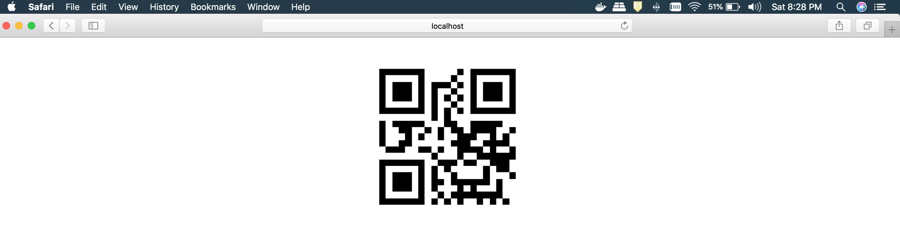

#Client side QRcode generator.

#Getting started

1. Go to project folder and install dependencies:
 ```bash
 npm install
 ```

2. Run 
  ```bash
 npm start:dev
 ```

#How to build
Run 
  ```bash
 npm build
 ```

#To generate new QRCode on 'src/index.js' file replace 'you rock' string with the QRCode text which you would like. 

#Scan QRCode with your smart phone camera (OR) QRCode reader, That's all!


#Dependiences modules
qrcode  [ https://www.npmjs.com/package/qrcode ]
webpack [ https://webpack.js.org/ ] 

[Screenshot](/screenshots/you_rock_qrcode.png)

<div align="center">
     
</div>
